# Studio IA — le manuel

Tout ce qu'il faut pour travailler avec Claude (app, Claude Code, Cowork) et
Higgsfield sans gaspiller de tokens ni de crédits.



Recherche et vérifications du 28 septembre 2026. Les réglages, workflows et prix
Higgsfield ont été relevés directement sur le connecteur Higgsfield ; le reste
vient de la documentation officielle d'Anthropic, des dépôts GitHub et de tests
indépendants, chaque volet relu par un vérificateur chargé de le contredire.

| Fichier | Contenu |
|---|---|
| [`index.html`](index.html) | La page : vidéo animée + manuel complet + fiche Higgsfield. Servie par GitHub Pages sur `/studio-ia/`. |
| [`video/manuel-studio-ia.svg`](video/manuel-studio-ia.svg) | La vidéo seule, en SVG animé (SMIL). S'ouvre dans n'importe quel navigateur et tourne en boucle. |
| [`video/manuel-studio-ia.mp4`](video/manuel-studio-ia.mp4) | La même vidéo exportée en MP4 (1920×1080, 25 i/s). |
| [`skills/higgsfield-genjutsu`](skills/higgsfield-genjutsu/SKILL.md) | Genjutsu sans erreur : bon modèle, bons rôles de médias, devis, un seul envoi, diagnostic. |
| [`skills/seedance-2-5`](skills/seedance-2-5/SKILL.md) | Seedance 2.5 : réglages, prix, gabarits de prompt, prolongation, retouche, protocole brouillon → final. |
| [`templates/projet-video`](templates/projet-video/) | Gabarit de projet : CLAUDE.md court, réglages qui empêchent Claude de lire les rendus, dossiers brief / refs / prompts / decisions / renders. |

## Installer les skills

Claude Code (Windows, Git Bash) :

```bash
mkdir -p ~/.claude/skills
cp -r studio-ia/skills/* ~/.claude/skills/
```

Pas besoin de redémarrer : Claude Code détecte en cours de session les skills ajoutés dans `~/.claude/skills`. Si le dossier `~/.claude/skills` n'existait pas au lancement de la session, taper `/reload-skills`.

claude.ai / Cowork : zipper le dossier d'un skill (le zip contient le dossier,
qui contient `SKILL.md`), puis *Personnaliser (Customize, dans la barre latérale) → Skills*, bouton « + » → « Create skill » → « Upload a skill », et importer le zip (l'exécution de code doit être active dans Réglages → Capacités).

## Régénérer la vidéo

```bash
cd studio-ia/video
python3 fetch_fonts.py        # une fois : polices embarquées dans le SVG
python3 build.py              # écrit manuel-studio-ia.svg + chapters.json
FFMPEG=ffmpeg node export.mjs mp4 1920   # export MP4 : plusieurs navigateurs en parallèle, ~3 min ici
cd ../page && python3 assemble.py        # reconstruit index.html
```

Le contenu des plans est dans la liste `SCENES` en bas de `video/build.py`.

L'export capture chaque image en PNG sans perte dans plusieurs navigateurs Chromium
en parallèle (un par cœur, moins un), puis un seul ffmpeg encode dans l'ordre avec
des réglages fixes (H.264, CRF 20, preset slow) : la qualité ne dépend pas du nombre
de navigateurs. `--workers N` force ce nombre. Mesuré sur une machine à 4 cœurs :
9 min 30 avant, 3 min 13 maintenant, image identique (SSIM 0,99999).
